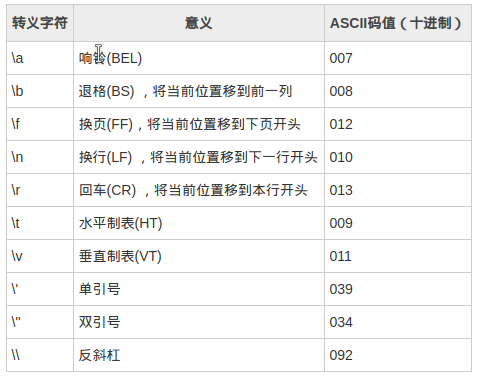

char* p //定义了一个变量， 它的类型是一个char指针
char (*p) //定义了一个指针， 它指向的类型是char

*的结合性是右到左
()的优先级比*高，所以函数指针的定义需要加()将*与指针名优先结合,(*p)()

函数指针的定义： int (*p)();  参数列表不是必要的，所以int (*p)() 等价于 int (*p)(int a)
              int (*fun())();与上面的相比，使用func()代替了p,所以可以看成是fun()这个函数执行之后,它的返回值是一个函数指针,这个函数
              指针所指向的函数是一个不带任何参数,并且返回值为int的一个函数
              所以，void (*signal(int sig_num, void (*handler)(int)))(int);定义的是一个函数，而不是一个指针变量

分析函数原型或变量定义时，要充分考虑结合优先级和结合性，从名称开始。

printf();只是将内容输出到缓冲区中，只有在遇到\n或者是缓冲区满了时，缓冲区的内容才会立即输出到STDOUT。

3. sizeof(指针) 返回指针变量本身的大小，同一台机器上，所有指针变量的大小都是一样的。
sizeof(数组名) 返回数组占用的字节数，以'\0'结束， 包括‘\0’。
4. 当函数使用数组作为参数时， 但在数组函数内部， 数组名已经变成了指针。

