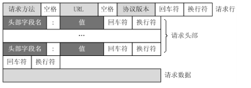
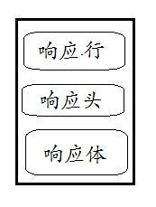

请求的格式 ：
      
     回车换行对的字符可能是'\r''\n', '\r', '\n'
     请求行以第一个“回车换行”结束
     请求头以两个连续的“回车换行”结束
     如果请求头没有设置Content-Length或Content-Length为0,则表明没有请求数据
响应的格式：
      

### https过程
    C：客户端把支持的加密算法发送给服务端
    S：服务端和自己支持的加密算法进行对比，如果不符合则断开连接，否则把符合的证书和算法发送给客户端
    C：客户端验证证书，通过后生成一个随机字符串，然后用服务端的公钥进行加密
    C：生成握手信息 用约定好的HASH算法，对握手信息进行取HASH，然后用随机字符串加密握手信息和握手信息的签名HASH值，把结果发给服务端
          （这里之所以要带上握手信息的HASH是因为，防止信息被篡改。如果信息被篡改，那么服务端接收到信息进行HASH时，就会发现HASH值和客户
           端传回来的不一样。这里就保证了信息不会被篡改）
    S：服务端接收到加密信息后，首先用私钥解密得到随机字符串。然后用随机字符串解密握手信息，获得握手信息和握手信息的HASH值，服务端对握
          手信息进行HASH，比对客户端传回来的HASH。如果相同，则说明信息没有被篡改
          服务端验证完客户端的信息以后，同样使用随机字符串加密握手信息和握手信息的HASH值发给客户端。
    C：客户端接收到服务端发回来的握手信息后，用一开始生成的随机字符串对密文进行解密，得到握手信息和握手信息的HASH值，像一步服务端验证
          一样对握手信息进行校验，校验通过后，握手完毕。从这里开始，客户端和服务端的通信        就使用那串随机字符串进行AES对称加密通信。
